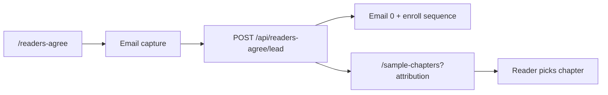
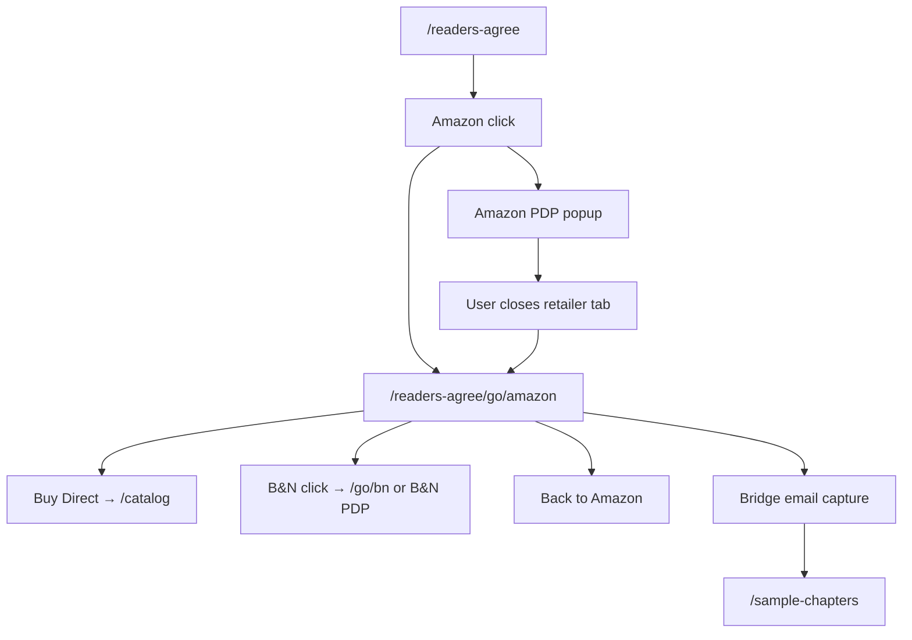
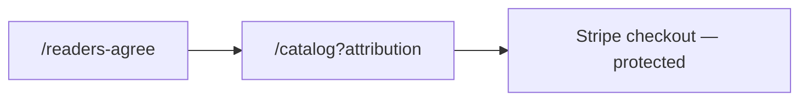

# Phase D — Email Capture + Retailer Return Bridge (Canonical Plan)

**Status:** **Approved direction — planning only** (do not implement until explicitly approved)  
**Last revised:** 2026-08-18  
**Supersedes:** Prior Phase D bridge behavior (“Ready to see for yourself?” dark continuation on `/readers-agree/go/amazon|bn`) and the Phase C interim **Start Reading →** green button on `/readers-agree`.

**Canonical index:** This document is the **authoritative Phase D plan**. Reconcile with:
- [`bn-funnel-buy-direct-best-value-plan.md`](bn-funnel-buy-direct-best-value-plan.md) — page jobs + merchandising boundaries
- [`bn-funnel-readers-agree-v2-study.md`](bn-funnel-readers-agree-v2-study.md) — RA v2 locked decisions
- [`bn-funnel-readers-agree-v2-prospect-nurture-study.md`](bn-funnel-readers-agree-v2-prospect-nurture-study.md) — 5-email sequence (production copy locked)

---

## Executive summary

Phase D adds **durable lead capture** on `/readers-agree` and **redesigns the Dorothy retailer-return bridge** as a calm “decide next” stage — not a repeat of the landing page and not the old generic continuation panel.

| Surface | Job |
|---------|-----|
| **`/readers-agree`** | **CHOOSE** — hero → pillars → story → three purchase buttons → **email capture** |
| **Retailer return bridge** (`/readers-agree/go/amazon`, `/go/bn`) | **DECIDE NEXT** — compare another retailer, Buy Direct, back to retailer, or email capture |
| **`/catalog`** | **SELL DIRECT** — best-value package (unchanged boundary) |
| **`/sample-chapters`** | **SELL THE STORY** — hub after email submit (not Chapter 1 direct) |

**Amazon Attribution:** Does **not** block Phase D. Use existing `buildAmazonProductUrl()` clean PDP fallback. Real tags added later through the same abstraction — no funnel redesign.

---

## 1. Amazon Attribution — non-blocking (locked)

| Rule | Detail |
|------|--------|
| **Now** | Clean PDP via `buildAmazonProductUrl()` → `https://www.amazon.com/dp/B0GWQBDH66` |
| **Author Central** | Still pending Amazon review — no `maas` tags yet |
| **Do not** | Invent or manufacture Amazon Attribution parameters |
| **Later** | Wire genuine Amazon-issued tags through `amazonAttribution.ts` + env — **no Phase D dependency** |

Applies to: landing Amazon button, bridge “Back to Amazon”, bridge alt-retailer links, popup destinations.

---

## 2. `/readers-agree` — replace Phase C placeholder

### Locked upper page (unchanged from Phase B/C)

```
Hero → Three Pillars → Locked story paragraph → [ Amazon | Barnes & Noble | Buy Direct ]
```

### Remove in Phase D

- **Large green `Start Reading →` button** (Phase C interim — explicitly temporary)
- Any standalone explore CTA competing with email capture

### Add immediately beneath purchase row

**Concise email capture** — informal and valuable, not a conventional newsletter block.

**Proposed copy direction (refinable at implementation review):**

> Get the free chapters — plus updates, extras, and other cool stuff.
>
> `[ Email address ]` `[ Start Reading → ]`

The submit button label may read **Start Reading →**; behavior is **email-gated explore**, not a bypass to `/sample-chapters/read/1`.

### On successful submission (locked)

| Step | Behavior |
|------|----------|
| **Persist lead** | Durable first-party record (`User` + `ReaderProfile` + attribution snapshot) |
| **Attribution** | Preserve `ref`, UTMs, `fbclid`, `visitorId`, agreed fields |
| **Nurture** | Enroll 5-email prospect sequence; send **Email 0** (welcome) via Mandrill |
| **Email content** | CTA links to **`/sample-chapters`** — **no PDF attachment**, no Chapter 1 deep link |
| **Browser redirect** | **Immediate** → **`/sample-chapters?{attribution}`** — **NOT** `/sample-chapters/read/1` |
| **Jody** | Suppress **mobile Jody Concierge gate** for this captured-reader journey only |
| **Referral / associate** | Existing attribution mechanics unchanged |

### `/readers-agree` page map (Phase D)

```
┌─────────────────────────────────────────┐
│ 1. Hero — Capitol + book (dark shell)   │
├─────────────────────────────────────────┤
│ 2. Three pillars                        │
│ 3. Locked story paragraph               │
├─────────────────────────────────────────┤
│ 4. [ Amazon ] [ Barnes & Noble ]        │
│    [ Buy Direct ]                       │
├─────────────────────────────────────────┤
│ 5. Email capture (concise, informal)    │
│    Submit → /sample-chapters (hub)      │
└─────────────────────────────────────────┘
```

**No** benefit copy, pricing, or Best Value on this page. **No** direct-sale pitch beyond the **Buy Direct** label (selling happens on `/catalog`).

---

## 3. Retailer return bridge — new role (MAJOR CHANGE)

### Context

The visitor has already:

1. Seen `/readers-agree`
2. Expressed purchase interest (Amazon or B&N click)
3. Visited the retailer in a new tab
4. Returned to our site **without necessarily purchasing**

### What we must NOT do

| Rejected | Why |
|----------|-----|
| Dump visitor back at the **beginning** of `/readers-agree` as the primary return UX | They already chose a retailer — repeating the landing wastes momentum |
| Repeat old bridge **“Ready to see for yourself?”** + generic Buy / Sample panel | Wrong job — bridge is **decide next**, not re-pitch the whole funnel |
| Put **direct-sale pitch** on bridge | `/catalog` owns value stack |
| Remove the bridge route | Bridge stays — it gets a **new visual treatment and content architecture** |

### Bridge job (locked)

**Help the shopper decide what to do next:** compare another source, go Buy Direct, return to the retailer they came from, or stay engaged via email.

**Momentum/session:** Preserve existing `readersAgreeMomentum.ts` signals (`validated`, `departed`, `active`) for promotion timing — but **replace** the continuation **UI** and **analytics** with the new decide-next layout.

---

## 4. Bridge visual treatment (locked direction)

Deliberately **different** from `/readers-agree`:

| Attribute | Direction |
|-----------|-----------|
| **Background** | Light gray / soft off-white |
| **Accents** | Restrained Agnes green |
| **Texture** | Very subtle green honeycomb / network-line treatment (**CSS-first** — no new graphic asset required for v1) |
| **Layout** | Clean, calm, spacious |
| **Exclude** | Black/red landing treatment, giant promotional graphics |

**Implementation note:** Propose CSS-only honeycomb (repeating linear-gradient or lightweight SVG background pattern) during implementation review. **Do not create visual assets** until CSS concept is shown and approved if a bitmap is still needed.

**New stylesheet (planned):** `readers-agree-bridge.css` — scoped to bridge pages only.

---

## 5. Amazon-return bridge (`/readers-agree/go/amazon`)

**Headline:** Still deciding?

**Subcopy:** Take another look, compare your options, or keep exploring.

**Primary actions (equal-weight row):**

```
[ Buy Direct ]  [ Barnes & Noble ]
```

**Secondary text link:** Back to Amazon → `buildAmazonProductUrl()` (clean PDP; bridge/popup behavior preserved)

**Email block (below):**

> Not ready yet? Stay in the loop.
>
> Get the free chapters, updates, extras, and other cool stuff.
>
> `[ Email address ]` `[ Keep Exploring → ]`

**On email submit:** Same lead pipeline as landing → redirect **`/sample-chapters?{attribution}`**.

**Context passed to lead API:** `captureSurface: 'bridge'`, `retailerOrigin: 'amazon'`.

---

## 6. Barnes & Noble-return bridge (`/readers-agree/go/bn`)

Same architecture, **context-aware** alternate retailer:

**Primary actions:**

```
[ Buy Direct ]  [ Amazon ]
```

**Secondary text link:** Back to Barnes & Noble → existing B&N PDP URL

Same email block and submit behavior as §5.

**Context:** `captureSurface: 'bridge'`, `retailerOrigin: 'bn'`.

---

## 7. Merchandising boundary (locked)

| Page | May say | Must NOT say on bridge |
|------|---------|------------------------|
| Bridge | **Buy Direct** (label only) | Signed copy, FREE eBook, bookmarks, 15% math, “Best Value” stack |
| **`/catalog`** | Full direct-offer pitch | — |

**Page focus recap:**

| Page | Job |
|------|-----|
| `/readers-agree` | CHOOSE |
| Retailer return bridge | DECIDE NEXT |
| `/catalog` | SELL DIRECT |
| `/sample-chapters` | SELL THE STORY |

---

## 8. End-to-end flows

### Flow A — Landing → email → sample hub



### Flow B — Landing → Amazon → bridge → decide



### Flow C — Landing → B&N → bridge → decide

Same as Flow B with retailers swapped (`retailerOrigin: 'bn'`, primary alt = Amazon).

### Flow D — Buy Direct from landing (unchanged Phase C)



---

## 9. Lead capture — infrastructure reuse (locked)

### New endpoint (recommended)

**`POST /api/readers-agree/lead`** (agnes-next → deepquill proxy pattern)

**Request body (study shape):**

```typescript
{
  email: string;
  visitorId?: string;
  ref?: string | null;
  code?: string | null;
  utm?: Record<string, string>;  // utm_source, utm_medium, utm_campaign, fbclid, src, origin, v
  consentAccepted: boolean;
  captureSurface: 'landing' | 'bridge';
  retailerOrigin?: 'amazon' | 'bn' | null;  // null on landing
}
```

### Server pipeline (reuse existing patterns)

| Step | Reuse |
|------|--------|
| 1. Identity | `ensureAssociateMinimal(email)` — `deepquill/api/associate/upsert.cjs` (same as Jody deliver / remember place) |
| 2. Profile | Upsert `ReaderProfile` with `source: 'readers-agree-v2'` |
| 3. Attribution snapshot | JSON on `ReaderProfile.leadAttribution` (new column — see §12) |
| 4. Funnel event | `recordFunnelEvent` → `READERS_AGREE_EMAIL_SUBMITTED` with surface meta |
| 5. Welcome email | Mandrill via `deepquill/lib/email/sendEmail.cjs` — new builder `buildProspectNurtureEmail0.cjs` |
| 6. Nurture enroll | Set `prospectNurtureEnrolledAt`, step `0` |
| 7. Optional sync | Mailchimp tag `readers-agree-v2-lead` (secondary — not primary storage) |
| 8. Client | `writeContestEmail(email)` + session marker for Jody suppress |

### Do NOT use as primary path

- **`POST /api/subscribe`** — Mailchimp-only, no DB attribution, no welcome email (see v2 study §5)

### Nurture sequence (unchanged)

5 emails — production copy locked in [`bn-funnel-readers-agree-v2-prospect-nurture-study.md`](bn-funnel-readers-agree-v2-prospect-nurture-study.md). All CTAs → `/sample-chapters?{enrollment attribution}`.

### Scheduled sends

Daily cron job pattern (new): `/api/cron/prospect-nurture` → deepquill admin job — per nurture study §3.

### Cohort exclusion

Update `send-no-purchase-reminders` to **exclude** `ReaderProfile.source = 'readers-agree-v2'` OR `prospectNurtureEnrolledAt IS NOT NULL` — per nurture study conflict table.

---

## 10. Analytics — events and payloads (locked plan)

Preserve all **Phase C** events. Add bridge-specific and enriched email events so we can answer: *Did a retailer visit lead to direct purchase intent, competitor retailer, or lead capture?*

### Phase C events (unchanged)

| Event | When |
|-------|------|
| `READERS_AGREE_PAGE_VIEW` | Landing view |
| `READERS_AGREE_AMAZON_CLICK` | Landing Amazon |
| `READERS_AGREE_BN_CLICK` | Landing B&N |
| `READERS_AGREE_BUY_DIRECT_CLICK` | Landing Buy Direct → catalog |
| `READERS_AGREE_*_CLICK` | Scroll/time events unchanged |

### Phase D — landing email

| Event | When | Payload meta (required) |
|-------|------|-------------------------|
| `READERS_AGREE_EMAIL_FORM_SHOWN` | Email block enters viewport (optional v1) | `{ surface: 'landing' }` |
| `READERS_AGREE_EMAIL_SUBMITTED` | Server-confirmed lead | `{ surface: 'landing', captureSurface: 'landing', destination: 'sample-chapters' }` + UTMs/ref in event meta via existing `trackFunnelEvent` merge |

### Phase D — bridge lifecycle

| Event | When | Payload meta (required) |
|-------|------|-------------------------|
| `READERS_AGREE_BRIDGE_VIEW` | Bridge decide-next UI shown (continuation promoted) | `{ retailerOrigin: 'amazon' \| 'bn' }` |
| `READERS_AGREE_BRIDGE_BUY_DIRECT_CLICK` | Buy Direct on bridge | `{ retailerOrigin, destination: 'catalog' }` |
| `READERS_AGREE_BRIDGE_ALT_RETAILER_CLICK` | B&N on Amazon bridge / Amazon on B&N bridge | `{ retailerOrigin, altRetailer: 'amazon' \| 'bn' }` |
| `READERS_AGREE_BRIDGE_BACK_TO_RETAILER_CLICK` | “Back to Amazon” / “Back to Barnes & Noble” | `{ retailerOrigin }` |
| `READERS_AGREE_BRIDGE_EMAIL_SUBMITTED` | Server-confirmed bridge lead | `{ retailerOrigin, captureSurface: 'bridge', destination: 'sample-chapters' }` |

**Reporting joins (examples):**

| Question | Query pattern |
|----------|---------------|
| Amazon visit → later Buy Direct | `READERS_AGREE_AMAZON_CLICK` → `READERS_AGREE_BRIDGE_BUY_DIRECT_CLICK` (same `visitorId`, `retailerOrigin: amazon`) |
| Amazon visit → switched to B&N | `READERS_AGREE_AMAZON_CLICK` → `READERS_AGREE_BRIDGE_ALT_RETAILER_CLICK` (`altRetailer: bn`) |
| Amazon visit → lead | `READERS_AGREE_AMAZON_CLICK` → `READERS_AGREE_BRIDGE_EMAIL_SUBMITTED` |
| Landing lead (no retailer) | `READERS_AGREE_EMAIL_SUBMITTED` with `surface: landing` |

### Deprecated / superseded (do not fire after Phase D)

| Event / UI | Status |
|------------|--------|
| Bridge continuation `READERS_AGREE_BUY_CLICK` on “Buy the Book” | **Replace** with `READERS_AGREE_BRIDGE_BUY_DIRECT_CLICK` |
| Bridge `READERS_AGREE_SAMPLE_CHAPTERS_CLICK` on “Read Sample Chapters” | **Remove** — sample path is email-gated → hub |
| `READERS_AGREE_RETAILER_RETURN` as analytics-only with minimal UI | **Superseded** by full bridge decide-next UI + `READERS_AGREE_BRIDGE_VIEW` |

**Deepquill allowlist:** Add new event types to `deepquill/lib/funnel/funnelEventTypes.cjs` + `agnes-next/src/lib/funnelTracking.ts`.

---

## 11. Attribution survival — retailer → bridge → catalog / sample

### Param keys (existing)

`READERS_AGREE_TRACKING_PARAM_KEYS` in `readerRecommendationLanding.ts`:

`ref`, `src`, `v`, `origin`, `code`, `utm_source`, `utm_medium`, `utm_campaign`, `fbclid`

### Survival rules (locked)

| Stage | Mechanism |
|-------|-----------|
| **Landing → retailer click** | UTMs/ref on `amazonGoHref` / `bnGoHref` bridge URLs |
| **Bridge URLs** | `buildReadersAgreePathWithTracking()` on all internal links (Buy Direct, alt retailer bridge nav, email redirect) |
| **Lead enroll** | Immutable `leadAttribution` JSON snapshot on `ReaderProfile` at first submit |
| **Post-submit redirect** | `/sample-chapters?{same params}` |
| **Nurture emails** | Every CTA rebuilds href from enrollment snapshot |
| **Catalog / checkout** | Middleware `ap_ref` / `ref` cookies + checkout metadata resolution (unchanged) |
| **Amazon outbound** | Site `ref` independent of Amazon `ref_=aa_maas` when tags arrive later |

### Bridge-specific

Record **`retailerOrigin`** in lead snapshot when captured on bridge — enables “Amazon window shopper became direct buyer” analysis without losing original campaign `ref`.

---

## 12. Jody suppression — narrow scope (locked)

### Goal

Visitor who **just gave email** on landing or bridge should not see **mobile Jody email gate** (`MobileChapterLanding`) again on first chapter read.

### Mechanism (study — minimal)

| When | Action |
|------|--------|
| Lead submit success (client) | `sessionStorage.setItem('readers_agree_v2_lead', '1')` + `writeContestEmail(email)` |
| Redirect | `/sample-chapters` hub (not chapter 1) |
| `ChapterReaderClient` mount | If marker **or** known `writeContestEmail` + recent RA lead session → **skip** `MobileChapterLanding`; show PDF reader |
| Clear marker | After first chapter open or session end — avoid permanent global bypass |

### Preserve (do NOT disable globally)

- Jody Concierge exit prompts (`JodyConcierge`, `useJodyChapterExit`)
- Phase 2 Known Reader continuation (when enabled)
- Jody for visitors who **did not** submit RA v2 email
- Desktop reader path (unchanged)

### Files (planned touch)

- `agnes-next/src/app/sample-chapters/read/[id]/ChapterReaderClient.tsx`
- Optional helper: `agnes-next/src/lib/readersAgreeLeadSession.ts`

---

## 13. Database / schema migration

**Yes — modest migration required** (per nurture study; not yet applied):

### `ReaderProfile` additions (Option A — recommended v1)

| Column | Type | Purpose |
|--------|------|---------|
| `leadAttribution` | `Json?` | Enrollment snapshot |
| `prospectNurtureEnrolledAt` | `DateTime?` | Sequence start |
| `prospectNurtureStep` | `Int?` | Last completed step 0–4 |
| `prospectNurtureLastSentAt` | `DateTime?` | Last send |
| `prospectNurtureSuppressedAt` | `DateTime?` | Purchase / unsubscribe |
| `prospectNurtureSuppressedReason` | `String?` | `purchased` \| `unsubscribed` \| `manual` |
| `emailMarketingConsentAt` | `DateTime?` | RA v2 form consent timestamp |

**Migration location:** `deepquill/prisma/schema.prisma` + migrate via existing Prisma workflow.

**Optional later:** `ProspectNurtureSend` log table for audit — not required for v1.

---

## 14. Expected files / components (implementation checklist)

### `/readers-agree` landing

| File | Change |
|------|--------|
| `agnes-next/src/app/readers-agree/ReadersAgreeLandingClient.tsx` | Remove Start Reading CTA; add email capture block |
| `agnes-next/src/components/readers-agree/ReadersAgreeEmailCapture.tsx` | **New** — shared form (landing + bridge variants) |
| `agnes-next/src/app/readers-agree/readers-agree-bn.css` | Email block styles; remove `.ra-bn-cta-primary` Start Reading prominence |
| `agnes-next/src/components/readers-agree/ReadersAgreeScrollCue.tsx` | Retarget to email block or purchase row (TBD at review) |

### Bridge

| File | Change |
|------|--------|
| `agnes-next/src/app/readers-agree/go/ReviewRedirectClient.tsx` | **Major rewrite** — light decide-next layout; remove “Ready to see for yourself?” |
| `agnes-next/src/app/readers-agree/go/readers-agree-bridge.css` | **New** — light theme + honeycomb CSS |
| `agnes-next/src/app/readers-agree/go/amazon/AmazonGoClient.tsx` | Pass `retailerOrigin: 'amazon'` |
| `agnes-next/src/app/readers-agree/go/bn/page.tsx` | Pass `retailerOrigin: 'bn'` (mirror Amazon client pattern if needed) |
| `agnes-next/src/lib/readersAgreeMomentum.ts` | Possibly add `retailerOrigin` session hint for analytics (optional) |

### Lead + nurture (server)

| File | Change |
|------|--------|
| `agnes-next/src/app/api/readers-agree/lead/route.ts` | **New** — proxy to deepquill |
| `deepquill/server/routes/readersAgreeLead.cjs` (or extend adminJobs) | **New** — lead handler |
| `deepquill/lib/email/builders/buildProspectNurtureEmail0.cjs` | **New** — Email 0 template |
| `deepquill/lib/email/builders/buildProspectNurtureEmail*.cjs` | Steps 1–4 (or single parameterized builder) |
| `deepquill/lib/jobs/sendProspectNurture.cjs` | **New** — daily batch |
| `agnes-next/src/app/api/cron/prospect-nurture/route.ts` | **New** — cron entry |
| `deepquill/lib/funnel/funnelEventTypes.cjs` | New event types |
| `agnes-next/src/lib/funnelTracking.ts` | New event types + bridge click helpers |

### Sample path + Jody

| File | Change |
|------|--------|
| `agnes-next/src/app/sample-chapters/read/[id]/ChapterReaderClient.tsx` | Jody gate suppress check |
| `agnes-next/src/lib/readersAgreeLeadSession.ts` | **New** (optional) — marker read/clear |

### Verification scripts (update when implementing)

| File | Change |
|------|--------|
| `agnes-next/scripts/verify-bridge-return.mjs` | Assert new bridge copy/actions, not “Ready to see for yourself?” |
| `agnes-next/scripts/verify-dorothy-d2.mjs` | Update for new bridge + landing email path |

### Protected — no changes

| Area | Rule |
|------|------|
| Stripe checkout / webhooks | No change |
| 15% referral discount logic | No change |
| $2 / $3 commission / payout | No change |
| Fulfillment | No change |
| Existing purchaser flows | No change |
| `buildAmazonProductUrl()` contract | Extend only when real tags arrive |

---

## 15. Conflicts with existing Phase B/C behavior

| Item | Phase B/C today | Phase D resolution |
|------|-----------------|-------------------|
| **Start Reading green button** | Phase C interim below purchase row | **Remove** — email capture is the explore path |
| **Bridge continuation UI** | Dark “Ready to see for yourself?” + Buy the Book / Read Sample Chapters | **Replace** with light decide-next + email block |
| **Bridge sample link** | Direct `/sample-chapters` without email | **Remove** — hub via email capture only on bridge |
| **Redirect after email** | v2 study locked `/sample-chapters` | **Confirmed** — not `/sample-chapters/read/1` |
| **Scroll cue target** | Phase C: first purchase button | **Repoint** to email block or keep on purchase row — decide at implementation review |
| **`verify-bridge-return.mjs`** | Passes against old continuation strings | **Update** when implementing |
| **`READERS_AGREE_BUY_CLICK` on bridge** | Fired today | **Migrate** to `READERS_AGREE_BRIDGE_BUY_DIRECT_CLICK` |
| **Canonical doc § Retailer return** | “Minimal treatment / no landing panel” | **Updated** — bridge gets full decide-next UI; landing stays clean |
| **Phase E in old plan** | Separate “Jody suppress marker” phase | **Fold into Phase D** — same delivery unit |

---

## 16. Implementation phases (revised)

| Phase | Scope | Status |
|-------|--------|--------|
| **A** | Study locked | ✓ |
| **B** | Hero, pillars, paragraph, typography | ✓ |
| **C** | Three purchase buttons, Amazon URL hook, bridge routes preserved | ✓ |
| **C-catalog** | Catalog Best Deal / signed copy / value stack | Pending |
| **D** | **This plan** — landing email, bridge redesign, lead API, nurture enroll, Jody suppress, bridge analytics | **Approved direction — await implementation approval** |
| **F** | Long-scroll testimonials / author on RA | Pending |
| **G** | Point ads to `/readers-agree` | Pending |

**Optional rollout flag:** `NEXT_PUBLIC_READERS_AGREE_V2=1` (staged enable for RA + bridge + lead endpoint).

---

## 17. Open items for implementation review

1. **Exact email capture copy** — direction locked; wording refinable  
2. **Scroll cue target** — purchase row vs email block  
3. **Bridge alt-retailer click** — navigate to `/go/bn` (two-tap mobile) vs direct B&N PDP popup (match landing bridge behavior)  
4. **Honeycomb CSS mock** — show in PR before any bitmap asset  
5. **Consent checkbox** — implicit submit vs explicit “updates” consent line (legal review)  
6. **`READERS_AGREE_EMAIL_FORM_SHOWN`** — ship in v1 or defer  

---

## Related documents

| Document | Role |
|----------|------|
| [`bn-funnel-buy-direct-best-value-plan.md`](bn-funnel-buy-direct-best-value-plan.md) | Page jobs + catalog boundary — **updated § Retailer return + Phase D** |
| [`bn-funnel-readers-agree-v2-prospect-nurture-study.md`](bn-funnel-readers-agree-v2-prospect-nurture-study.md) | Email 0–4 production copy + cron |
| [`bn-funnel-readers-agree-amazon-attribution-study.md`](bn-funnel-readers-agree-amazon-attribution-study.md) | Tags when Amazon approves |
| [`funnel-analytics.md`](funnel-analytics.md) | Event architecture (update when implementing) |

---

*Planning only. No code, commit, push, or deploy until Phase D implementation is explicitly approved.*
